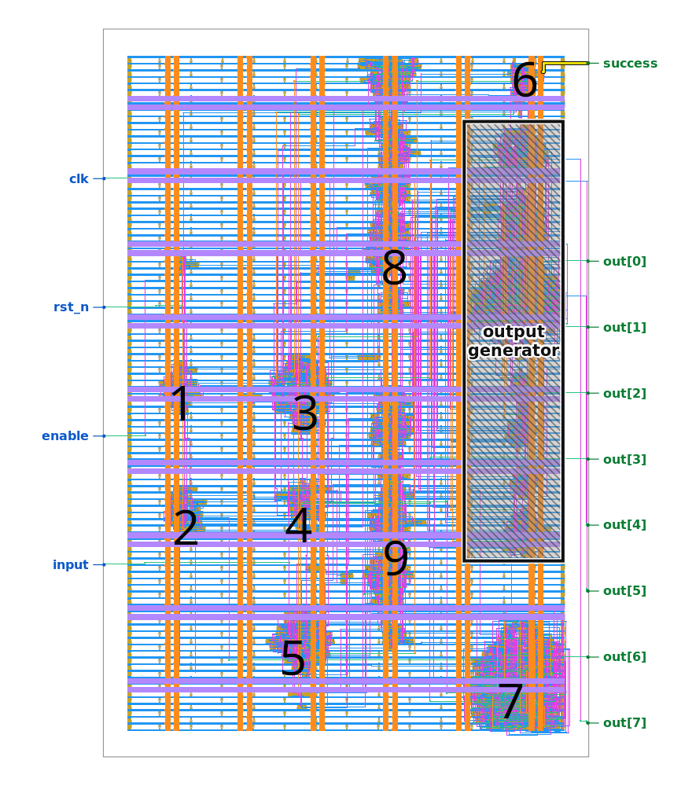

# Jane Street ASIC challenge 2026

Challenge link: [Can you reverse engineer an ASIC?](https://blog.janestreet.com/can-you-reverse-engineer-an-asic/)

##  Simulating the circuit

By studying the warmup files I learned that the challenge author synthesized
the warmup and puzzle designs using SKY130 PDK. I downloaded a build of the PDK
using ciel, and I used the corresponding technology file to open the design in
magic VLSI. From magic VLSI, I extracted puzzle.gds to a SPICE netlist. I
noticed that magic VLSI emitted "declarations" for each sky130 cell used in the
design, including a declaration for the puzzle module.

```spice
.subckt sky130_fd_sc_hd__nor4_2 C D Y A B VGND VPWR VPB VNB
.subckt sky130_fd_sc_hd__or2_2 B X A VPWR VGND VPB VNB
.subckt sky130_fd_sc_hd__and2b_2 X B A_N VPWR VGND VPB VNB
.subckt sky130_fd_sc_hd__o31ai_2 A1 Y B1 A3 A2 VGND VPWR VPB VNB
.subckt sky130_fd_sc_hd__decap_3 VPWR VGND VPB VNB
.subckt sky130_fd_sc_hd__a31o_2 X B1 A3 A1 A2 VGND VPWR VPB VNB
.subckt sky130_fd_sc_hd__and3_2 B X A C VPWR VGND VPB VNB
.subckt sky130_fd_sc_hd__nand4_2 B A Y D C VGND VPWR VPB VNB                                                                                                                                                                                
...
.subckt puzzle I O[0] O[1] O[2] O[3] O[4] O[5] O[6] O[7] clk enable rst_n success
+ VGND VPWR
```

Using this information I translated each line of the SPICE netlist...

```spice
Xsky130_fd_sc_hd__nor4_2_0 sky130_fd_sc_hd__or4b_2_2/C sky130_fd_sc_hd__or4b_2_3/C
+ sky130_fd_sc_hd__nor4_2_0/Y sky130_fd_sc_hd__or4b_2_3/A sky130_fd_sc_hd__or4b_2_3/B
+ VGND VPWR sky130_fd_sc_hd__nor4_2_0/VPB VGND sky130_fd_sc_hd__nor4_2
```

...into a syntactically-valid Icarus verilog module instantiation:

```verilog
sky130_fd_sc_hd__nor4_2 Xsky130_fd_sc_hd__nor4_2_0 (
  .C(sky130_fd_sc_hd__or4b_2_2__C)
  .D(sky130_fd_sc_hd__or4b_2_3__C)
  .Y(sky130_fd_sc_hd__nor4_2_0__Y)
  .A(sky130_fd_sc_hd__or4b_2_3__A)
  .B(sky130_fd_sc_hd__or4b_2_3__B);
```

At this point I removed all references to VGND, VPWR, VPB, and VNB from the
translated verilog module instantiations. I also removed a bunch of redundant
clocks, buffers, decaps, tapvpwrvgnds, and diodes generated by the synthesis
tool.

The Sky130 PDK provides appropriate verilog implementations for each Sky130
cell in the puzzle design. Using these definitions, I wrote a separate
[testbench](./tb.v) that drove the puzzle module from the previous step and
matched the provided `example_inputs.vcd` exactly.


## Analyzing the circuit

The original SPICE netlist I generated from magic VLSI described around 2000
cells. To simplify the puzzle, I used magic VLSI to enumerate cells from each
geometric "cluster" in the original layout.



I moved all of the cells from each cluster into their own submodules in
[01_puzzle.v](./01_puzzle.v) for organization.

I quickly identified the module responsible for setting the success pin high
(corresponding to the geometric cluster of cells located closest to the success
pin, module 6 in my diagram). I isolated this module into a separate testbench
to study how the input wires affected the output.

```verilog
wire hint;
wire write_output;
module_6 m6 (
  .clk(clk),
  .rst_n(rst_n),
  .check_solution(check_solution),
  .check1(check1),
  .check2(check2),
  .check3(check3),
  .check4(check4),
  .check5(check5),
  .hint(hint), // output
  .write_output(write_output), // output
  .success(success)); // output

module_output o1 (
  .clk(clk),
  .I(I),
  .running(running),
  .success(success),
  .hint(hint),
  .got_all_ones(got_all_ones),
  .got_all_zero(got_all_zero),
  .write_output(write_output),
  .rst_n(rst_n),
  .O(O)); // output
```

I noticed a few interesting behaviors by playing with each input pin to module
6 and to the output module, and by reviewing the logic in module 6:

* When I drove all checks low and `got_all_ones` high, the output module
  printed *EMPTY SKY*
* When I drove all checks low and `got_all_zero` high, the output module
  printed *BIG BANG*
* When I drove checks1-4 high but drive check5 low, module 6 set the hint wire
  high and the output module printed *TWO NOT TOUCH*. I figure that Jane Street
  inserted this message to hint at check5's function.

Finally, when I drove all checks high, module 6 set the success wire high but
the output module printed garbage. Since the output module accepted the input
wire I as an input, I deduced that the secret message depended on the input
somehow.

I went back to my original testbench and studied how my inputs affected each
check. I quickly knocked out checks1-4 this way. To figure out check5 I studied
the warmup puzzle provided by Jane Street. This warmup puzzle used a couple of
[shift registers](https://github.com/janestreet/asic-puzzle-2026/blob/ffd53e0ba24e2fc1c1b12dc824e8eac5888c19a9/warmup/00_source.v#L1-L14)
to add two 8-bit integers and compare the sum to a constant 496. The synthesis
tool converted this shift register into a simple pattern of muxes and flops:
[01_netlist.v](https://github.com/janestreet/asic-puzzle-2026/blob/ffd53e0ba24e2fc1c1b12dc824e8eac5888c19a9/warmup/01_netlist.v#L401-L464).
I noticed that the module corresponding to check5 (module 3 in my puzzle.v)
also instantiated a shift register of length 12 with the same pattern.

I concluded that these checks interpreted the 121-bit input bitstring as an
11x11 grid, where each set bit represents a star in the sky:

* Check 1 asserts that the grid contains 22 stars
* Check 2 asserts that each row contains 2 stars
* Check 3 asserts that each column contains 2 stars
* Check 4 divides the grid into 11 regions, and asserts that each region contains 2 stars
* Check 5 asserts that no two stars are adjacent ("touching") on the grid

I wrote a recursive algorithm in python to enumerate all possible inputs. I
found only one input that passed every check:

    00000001010
    10000100000
    00000001010
    10100000000
    00001010000
    00100000100
    00001000001
    01000010000
    00010000001
    00000100100
    01010000000

When I supplied this input to the circuit in my testbench, the circuit set the
success pin high and printed the message *(\* TWO STARS \*)* to the O pins.

## Output module analysis

Previously I identified that the circuit derived the secret message based on
the input bitstring to prevent someone from extracting the secret message
without the correct input. I reconstructed the secret message computation by
analyzing the output module netlist and by applying guess-and-check with my
testbench:

```python
out = [0x8a, 0x6a, 0x3e, 0x46, 0xd6, 0xbc, 0xd9, 0x70, 0xbe, 0xa4, 0x02, 0xad, 0x56, 0x30, 0x4a]
reg = [0x00, 0x01, 0x01, 0x01, 0x01, 0x01, 0x01, 0x00, 0x00, 0x01, 0x01, 0x01, 0x01, 0x01, 0x01]
def compute_output(I):
    # lfsr
    # initial state: 0xa5
    # feedback poly: 0xb8
    csum = 0xa5
    for idx in range(121):
        csum_ = csum
        csum = ((csum << 1) ^ b(I, idx) ^ b(csum, 3) ^ b(csum, 4) ^ b(csum, 5) ^ b(csum, 7)) & 0xff
    data = b(csum_, 0)
    msg = bytearray()
    for idx, (succ, init) in enumerate(zip(out, reg)):
        msg.append(succ ^ csum ^ 0b1100111)
        # lfsr with feedback poly, formulated as a companion matrix, applied 8 times
        csum0 = b(csum, 2) ^ b(csum, 5) ^ b(csum, 6)
        csum1 = b(csum, 3) ^ b(csum, 6) ^ b(csum, 7)              ^ init
        csum2 = b(csum, 0) ^ b(csum, 5) ^ b(csum, 6) ^ b(csum, 7)
        csum3 = b(csum, 0) ^ b(csum, 4) ^ b(csum, 5) ^ b(csum, 7) ^ data
        csum4 = b(csum, 0) ^ b(csum, 2) ^ b(csum, 4)              ^ data
        csum5 = b(csum, 2) ^ b(csum, 3) ^ b(csum, 5)              ^ data
        csum6 = b(csum, 2) ^ b(csum, 3) ^ b(csum, 4) ^ b(csum, 6)
        csum7 = b(csum, 3) ^ b(csum, 4) ^ b(csum, 5) ^ b(csum, 7)
        data = b(csum, 7) ^ b(csum, 6) ^ b(csum, 3)
        csum = (csum0 << 0) | (csum1 << 1) | (csum2 << 2) | (csum3 << 3) | \
               (csum4 << 4) | (csum5 << 5) | (csum6 << 6) | (csum7 << 7)
    return msg
```

The circuit computes an LFSR over the input bitstring with an initial state of
0xa5 and with a feedback polynomial of 0xb8 ($x^7 + x^5 + x^4 + x^3$). Then,
the circuit derives the secret output using some formulation of the original
LFSR using its companion matrix applied 8 times
(XREF [wikipedia](https://en.wikipedia.org/wiki/Linear-feedback_shift_register#Matrix_forms)).
